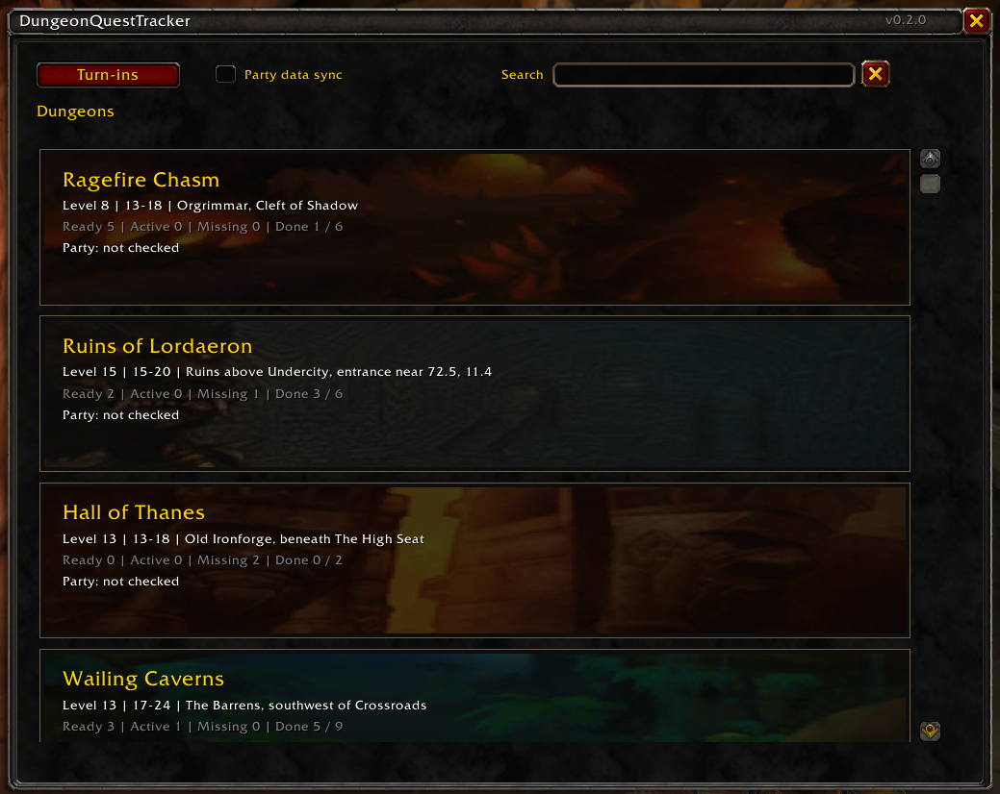
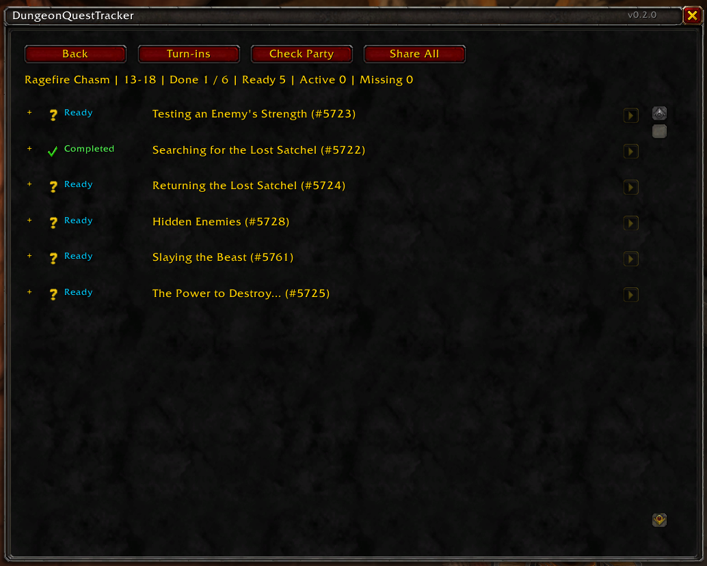
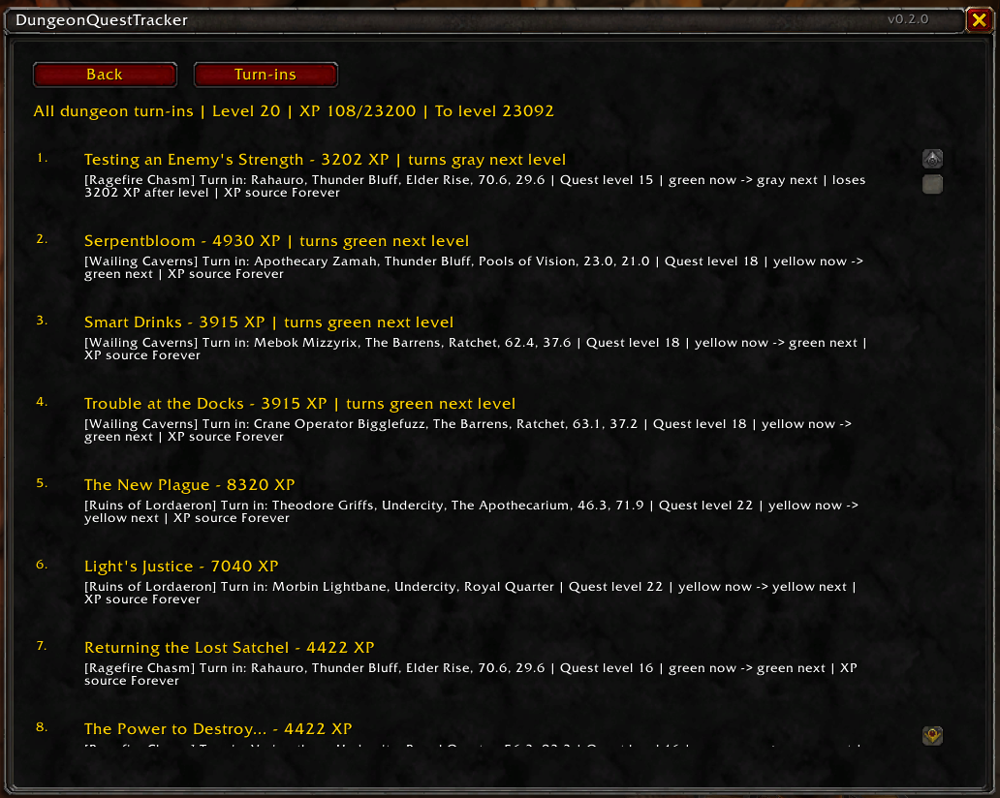
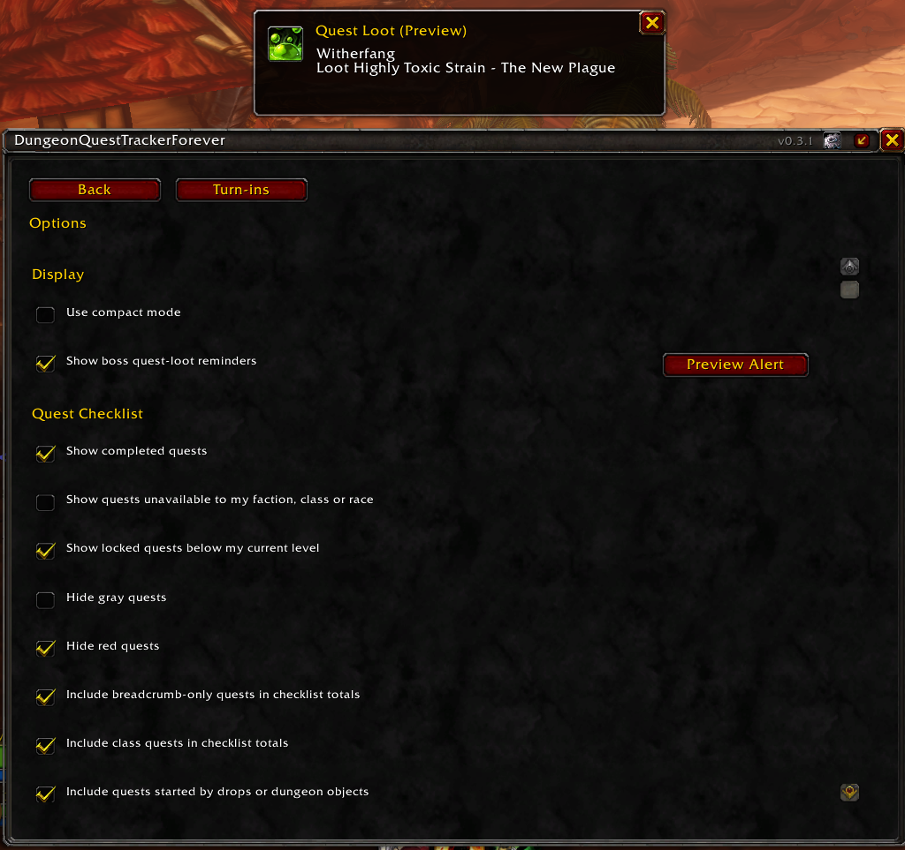

# DungeonQuestTrackerForever

DungeonQuestTrackerForever is a World of Warcraft: Forever addon for tracking dungeon quests during beta. It shows which dungeon quests your character has completed, has ready to turn in, is actively working on, or is still missing, along with pickup locations, turn-in locations, prerequisite notes, and turn-in priority.

The current target is the level 30 beta wave, including dungeon quests available to pick up through level 35.

## Features

- Scrollable dungeon checklist with collapsible quest rows and status icons.
- Dungeon quest follow-ups grouped beneath their originating quests, with indented labels in full and compact modes.
- Dungeon selection screen with scrollable activity-style dungeon cards.
- Dungeon search by name, key, or location, with party summaries on cards.
- Global turn-in planner for all tracked dungeon quests.
- Turn-in priority based on quest XP, current player level, current XP, and whether a quest may drop to green or gray after leveling.
- Ready-for-turn-in detection for active quest-log quests.
- Completed quest detection using quest history APIs where available.
- Faction, class, race, minimum-level, and prerequisite-aware quest visibility.
- Minimap button with left-click to open DQT, right-click to open turn-ins, and drag-to-move support.
- Party quest status checking through addon messages when party members also have DQT installed.
- Share All button for the selected dungeon, using the game client's built-in quest sharing API for quests that are in your log and shareable.
- Scrollable Options view for filters, minimap controls, party behavior, and sharing confirmation.
- Saved compact/full display modes with a title-bar toggle beside Close.
- Boss quest-item loot alerts with a notification sound, a 15-second display, and a fade-out during the final second.
- Preview Alert button in Options to test the loot banner and sound without killing a boss.
- Opt-in party quest-data sync for missing catalog records, with received data clearly marked as unverified.

## Screenshots

### Dungeon List

Browse dungeon cards with level ranges, locations, quest totals, and party status. Search narrows the list, and party quest-data sync is opt-in.



### Quest Checklist

See completed and ready quests at a glance. Follow-ups are grouped beneath their parent quests instead of mixed into a flat list. Expand rows for pickup, turn-in, and prerequisite details; use the party and sharing controls for the selected dungeon.



### Turn-In Priority

Plan turn-ins across all tracked dungeons using current level and XP, reward estimates, and quests at risk of changing color after leveling.



## Tracked Dungeons

Current tracked dungeon data includes:

- Ragefire Chasm
- Wailing Caverns
- Deadmines
- Ruins of Lordaeron
- Hall of Thanes
- Shadowfang Keep
- The Stockade
- Excavation Site: Wetlands (seven provisional quest records)
- Blackfathom Deeps
- City of Dalaran (no quests recorded yet)
- Scarlet Monastery: Graveyard
- Gnomeregan
- Scarlet Monastery: Library
- Razorfen Kraul
- Scarlet Monastery: Armory

Quest data is curated locally because the WoW API does not expose a complete dungeon quest catalog with pickup locations and prerequisite chains. XP values are intended to use Forever beta dungeon quest rewards where verified.

**XP values are in flux during the Forever beta and are being updated as soon as new information becomes available.** All 56 positive old Forever rewards use the bonus-reduction model, with a quest-specific baseline where known or a labelled same-level assumption otherwise. Small rewards with no inferred positive bonus stay unchanged. Classic-only and unknown rewards remain provisional fallbacks/unknowns; turn-in priority and predicted level-ups are not guarantees.

For example, The New Plague uses an assumed 1750 XP baseline and estimates 5035 XP, rather than its old 8320 XP. Baseline assumptions and sources are recorded in [data verification notes](Docs/DATA_VERIFICATION.md). Reports should include quest ID, client build, character level, exact reward and applicable bonuses.

Dungeon chains include catalogued follow-ups outside the instance: Hidden Enemies, In Nightmares, all five Unending Torment steps, the Deadmines/Stockade chain through An Audience with the King, Gnomeregan ring returns, Library book/class-quest returns, shared Paladin forging rewards, and Razorfen Kraul Warrior armor branches. Each continuation joins its originating dungeon automatically, with completion and readiness tracked independently by quest ID. Ready follow-ups remain in the global Turn-ins list even when checklist or dungeon display filters hide their rows; the separate gray-turn-in option still applies. Rewards use a labelled Classic fallback only where available; otherwise XP stays unknown. This is curated coverage, not automatic discovery of unknown follow-ups.

Quest records use [Forever quest listings](https://www.wowhead.com/forever/guide/dungeons/every-dungeon-quest-location) and database pages; old beta XP is sourced from [WCLBox](https://wowforever.wclbox.com/en/fuben). The [October 1 bonus reduction](https://us.forums.blizzard.com/en/wow/t/wow-forever-beta-development-notes-%E2%80%93-updated-october-1/2360696) is modeled as normal XP plus half the previous bonus, not half the whole reward. Rewards, rounding, pickup locations and prerequisites still need beta-client confirmation.

Excavation Site now includes seven quests from the [October 2 dungeon guide](https://www.wowhead.com/forever/guide/excavation-site-wetlands-dungeon-overview-location-rewards). XP is unknown and some contacts, exact levels and follow-up IDs remain unconfirmed. City of Dalaran remains an empty placeholder. Scarlet Monastery wings share relevant quests, but the global turn-in planner counts each quest once.

## Install

Download `DungeonQuestTrackerForever-0.4.1.zip` from the [GitHub release](https://github.com/jturnham/DungeonQuestTracker/releases/tag/v0.4.1) and extract it into your World of Warcraft client's `Interface/AddOns` directory. The ZIP already contains the `DungeonQuestTrackerForever` folder; do not add an extra enclosing folder.

When upgrading to the renamed addon, remove the old `DungeonQuestTracker` folder from `Interface/AddOns` before installing `DungeonQuestTrackerForever`, so only one copy loads. With WoW closed, copy `WTF/Account/<account>/SavedVariables/DungeonQuestTracker.lua` to `DungeonQuestTrackerForever.lua` to retain settings. Do not overwrite an existing new-name saved file. The internal `DungeonQuestTrackerDB` variable and `/dqt` command are retained for compatibility. The GitHub repository URL is unchanged.

## Usage

Open the addon with:

```text
/dqt
```

Useful commands:

```text
/dqt list
/dqt rfc
/dqt wc
/dqt deadmines
/dqt rol
/dqt hot
/dqt sfk
/dqt stocks
/dqt turnins
/dqt debug
/dqt options
/dqt minimap
```

Use `/dqt dungeon <key>` for any dungeon, including `blackfathom-deeps`, `gnomeregan`, `razorfen-kraul`, `excavation-site-wetlands`, `city-of-dalaran`, and `scarlet-monastery-graveyard`, `scarlet-monastery-library`, or `scarlet-monastery-armory`. `/dqt list` prints all keys.

The minimap button also opens the addon:

- Left-click: dungeon list
- Right-click: global turn-ins
- Drag: reposition button

## Options

### Compact Mode

The compact/full toggle sits beside Close in the title bar. Compact mode uses a smaller window, plain dungeon names, and quest names colored by status. Hover over entries for status, locations, and prerequisite notes. Turn-ins keep their priority order but show only rank and quest name, with reward details on hover.

Switching back restores dungeon artwork, quest IDs, sharing buttons, and expanded quest details. Search and filters work in both modes, and the choice persists after reload. Options stays full-width so settings remain readable; its Display section also controls compact mode.

### Settings

Use the gear button in the title bar or `/dqt options`. Settings apply immediately, persist in `DungeonQuestTrackerDB` after reload, and Back returns to the previous view.

- Checklist: show completed/unavailable/low-level locked quests, hide gray/red quests, and include or exclude class, breadcrumb-only, and drop/object-start quests.
- Display: switch compact mode, enable or disable boss quest-loot reminders, and use Preview Alert to check the banner and notification sound.
- Dungeon list: hide gray/red dungeons, set upper/lower level gaps (0-60), or show only missing/locked quests or ready turn-ins. Enabling both list-only filters requires both to match.
- Turn-ins: explicitly exclude gray ready quests from priority. Other checklist and dungeon filters do not suppress the global planner.
- Minimap/party: toggle the minimap button, status responses, automatic broadcasts on dungeon open, Share All confirmation, and party data sync.

Gray/red filtering is on by default. Green, yellow, and orange quests remain visible. Ready quests are exempt from quest color filtering, and required gray prerequisites blocking an in-range quest remain visible. Out-of-range dungeons are hidden even when they have current quests; turn off the active/ready override in Options to keep those dungeons in the list. The global turn-in planner still includes their ready quests.

Dungeon colors use the recommended range: the upper level for gray and the lower level for red. Red means at least five levels above you; gray uses the client's green range when available. A dungeon whose visible quests are all gray is also hidden. These rules apply to empty placeholders too. Unknown player or quest levels are not treated as gray/red.

Level gaps use the recommended range: its upper end for dungeons below you and lower end for dungeons above you. Unknown pickup types stay visible; known drop/object starts and identified breadcrumb-only quests can be excluded. The footer shows filter status and hidden counts; hover for details or click for Options.

Reset Filters restores filter defaults, including gray/red filtering. Reset Minimap Position restores the button position without changing visibility. `/dqt minimap` toggles visibility directly. Completed in-range quests stay visible by default and unavailable quests are hidden. The earlier inactive range defaults are upgraded once; subsequent explicit choices persist across reloads.

Party responses are on by default; automatic broadcasts and Share All confirmation are off. Automatic broadcasts have a five-second per-dungeon cooldown and do not request replies. Disabling status responses does not disable separately opted-in quest-data sync. If confirmation is enabled but its dialog is unavailable, Share All sends nothing.

## Party Checking

Open a dungeon checklist and press `Check Party` to request quest status from party members.

Party checking works through WoW addon messages, so party members need DungeonQuestTrackerForever installed and enabled to respond. Expanded quest rows show a summary of how many responding party members have each quest completed, ready, active, or missing/locked.

Checks have a five-second cooldown per dungeon. Status is cleared when the group roster changes and expires after two minutes. Realm-qualified sender names are normalized against your current group. Large checklists are split into messages within the client's size limit.

## Quest Sharing

Open a dungeon checklist and press `Share All` to attempt sharing every active or ready quest for that dungeon.

Each quest row also has a share arrow, enabled when grouped and the client marks that active or ready quest shareable. Hover over the sharing and party controls for availability details.

The client only allows sharing quests that are currently in your quest log and marked pushable by the game. Some quests cannot be shared because they start from drops, objects, class chains, prerequisite chains, or other restricted sources.

Share All reports requests sent to the client, rather than whether another player accepted. Skipped quests are grouped by reason, and missing sharing APIs produce feedback instead of a Lua error.

## Party Quest-Data Sync

Enable **Party data sync** on the dungeon list, or run `/dqt sync on`, on both clients. Check Party and successful quest-share requests offer the sender's bundled quest IDs. An opted-in recipient requests only missing records and adds them to the appropriate known dungeon, independently of accepting the actual game quest.

Received records are labelled **Party supplied**, with sender and addon version. They live in a separate saved-variable cache; bundled records always win. Party-supplied XP is excluded from ranking (shown as zero/unknown), and received records are never forwarded. Sync cannot discover quests absent from both catalogs or add unknown dungeons. Older DQT clients without this protocol cannot exchange records.

Transfers use validated fields, messages under 255 bytes, a five-message-per-second queue, at most 16 pending records, and a 200-record cache. Incomplete transfers expire after three minutes; changing groups cancels transfers. The sync update frame sleeps when idle. Record requests/replies use whispers to normalized group members; client messaging restrictions may prevent transfer, especially across instance realms. Check Party can retry an incomplete transfer.

Use `/dqt sync off` to disable exchange and hide received quests without deleting them. `/dqt sync clear` deletes the received cache. Data is party-supplied, not trusted or automatically verified.

## Data Verification

Bundled quests include source links, source notes, confidence, and pending verification notes for XP, pickup, turn-in, and prerequisites. Source discrepancies appear in expanded quest rows. See [data verification notes](Docs/DATA_VERIFICATION.md). No unverified record is promoted to in-game verified merely because it was sourced or synced.

## Boss Quest-Loot Reminders

Don't leave a quest item on a boss! Known boss drops trigger a **Quest Loot** banner near the top of the screen, even with the checklist closed. The banner shows the boss, item, and associated quest, plays a notification sound, and stays visible for 15 seconds, fading out during the final second. Close it with the X to dismiss it sooner. Duplicate boss notifications and updates to the remaining items do not replay the sound.



Open **Options > Display** to toggle reminders or click **Preview Alert** to test the same banner, sound, and fade-out. The preview works even when reminders are disabled and does not change your quest status. Sound follows the client's master sound settings; if sound playback is unavailable, the visual alert still works.

Reminders use public boss-kill and successful encounter-end notifications, not restricted combat-log access. When no encounter notification is available, a read-only fallback checks opened loot for known quest-item IDs in the current dungeon. That fallback only works after you click a corpse; it cannot remind you about an unopened corpse. Auto-loot gets a brief chance to collect items before fallback checks, and duplicate encounter/loot notifications do not replay alerts. Unavailable or secret loot data is skipped. These newer triggers still need verification in the beta client.

An alert reminds you to check the corpse, but does not guarantee a drop or loot eligibility. Completed/ready quests, unavailable quests and items already in your bags are suppressed. Objective drops require an active quest; quest-starting items can be highlighted before you accept their quest. Looting the item or accepting its starting quest clears the reminder.

Coverage includes VanCleef's Unsent Letter, Mutanus' Glowing Shard, Charlga Razorflank's Small Scroll, Witherfang's Highly Toxic Strain, and The Baron's faction-specific heads. The Stockade also includes the Head of Bazil Thredd, Head of Targorr, Hand of Dextren Ward, and Head of Deepfury. The loot-window fallback covers mapped items with known item IDs; The Baron's Alliance head currently lacks a mapped item ID. The Baron's English-name fallback is restricted to Ruins of Lordaeron until its NPC ID is confirmed. Random trash drops and ground objects are not inferred from boss deaths. Toggle reminders under Options > Display.

Single-copy objective drops also include Mad Magglish's 99-Year-Old Port, Foreman Thistlenettle's Badge, Techbot's Memory Core, and Roogug's Vial of Phlogiston for either Warrior armor quest. Entrance-area drops use opened-loot detection in their associated zones. Multi-item collection drops such as bandanas, hides, and guano are deliberately excluded to avoid repeated alerts.

Stockade coverage, these single-copy drops, and the loot-window/encounter-end fallback are included starting with 0.4.1. Notification delivery and loot API access still need verification in the beta client.

## Project Layout

```text
DungeonQuestTrackerForever/
  DungeonQuestTrackerForever.toc
  Config.lua
  Core.lua
  Options.lua
  LootReminders.lua
  Data/
    DungeonData.lua
    QuestData.lua
    QuestDataLevel35.lua
    QuestFollowUps.lua
    QuestMetadata.lua
  QuestDataSync.lua
  UI/
    MainFrame.lua
    Options.lua
    MinimapButton.lua
Docs/
  DATA_VERIFICATION.md
images/
  dungeon-list.png
  loot-alert.png
  quest-checklist.png
  turn-in-priority.png
Tools/
  validate-data.ps1
```

## Packaging

From the repository root, create a tester zip that contains the `DungeonQuestTrackerForever/` folder at the archive root:

```powershell
.\Tools\package-release.ps1
```

This produces `release/DungeonQuestTrackerForever-0.4.1.zip` and checks its version and folder layout. Testers can extract that zip directly into `Interface/AddOns`.

## Development Notes

- Current addon version: `0.4.1`.
- Current TOC interface: `16001`.
- Saved variables live in `DungeonQuestTrackerDB`.
- The UI intentionally uses native WoW frames and templates only, with no external addon library dependency yet.
- Quest state detection supports both `C_QuestLog` APIs and older fallback APIs where possible.
- `/dqt debug <questID>` reports the resolved quest state, ID/title log matches, completion/readiness, availability, and the last caught API error. `/dqt debug` reports client API support.
- Data accuracy is the main ongoing risk during beta because Forever quest rewards, availability, and custom dungeon data can change.
- Dungeon scans reuse player context and avoid unused turn-in rankings. Search skips nonmatching dungeon scans, while rapid quest/XP and incoming party updates are combined into one refresh. No refresh update callback runs while idle.

The level 35 wave has a Lua smoke test for data references, quest restrictions and states, shared turn-ins, empty checklists, and scrolling/navigation. Install `fengari` and `luaparse` in a separate development directory, then run `node Tools/test-level35.cjs <development-directory>`. These tools are not addon dependencies. UI tests use mocked WoW frames; the real layout and client APIs still need in-game testing.

Append `Tools/test-stability.lua` to that command to also test missing/throwing APIs, legacy quest completion, failed quests, party cooldowns and message splitting, sender normalization, sharing failures, and minimap guards.

Append `Tools/test-ui.lua` before the stability tests to check search, empty results, long text sizing, and scroll preservation during refresh.

The regression suites cover sync, filters, color boundaries, defaults migration, compact/full transitions, wrapping, persistence, sharing confirmation, party settings, throttling, XP estimates, follow-up grouping and state tracking, loot-alert previews/sound/fading, and performance call counts. Use the full validation command below to run them all.

Run `./Tools/validate-data.ps1 -DependencyDirectory <development-directory>` for the full release audit and all regression suites. The audit detects duplicate quest/table keys before Lua evaluation, unresolved dungeon and prerequisite references, prerequisite cycles, invalid restriction enums, incomplete locations, and invalid XP/level values. Structural validation does not prove beta data accuracy.

## License

DungeonQuestTrackerForever code is released under the MIT License. See `LICENSE`.

World of Warcraft names, quests, NPCs, locations, and related game content are trademarks and/or copyright of Blizzard Entertainment. Quest data in this addon is factual, curated, and written for addon functionality.
